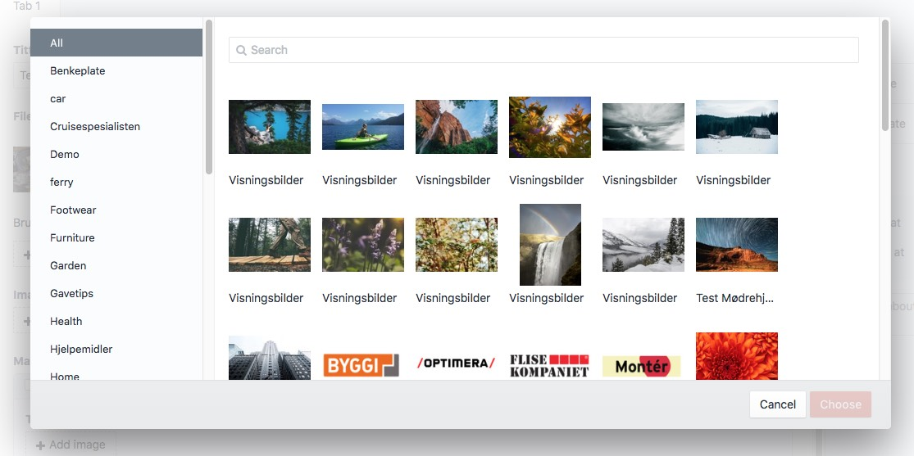
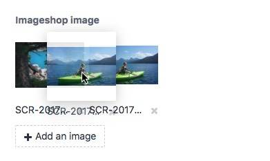
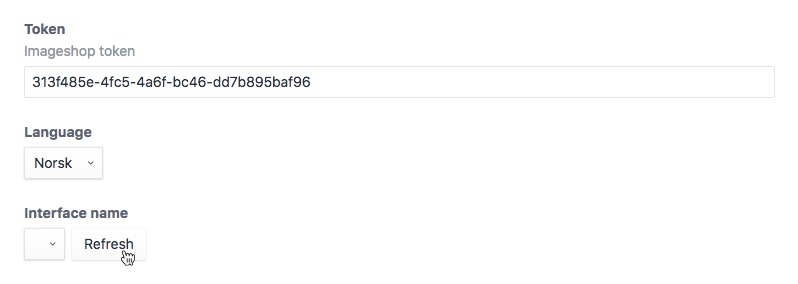
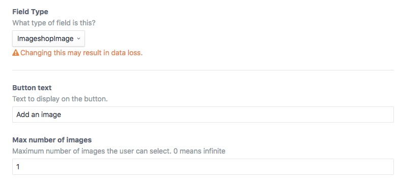

# Imageshop plugin for Craft CMS 3.x

Integrate with an Imageshop account and use Imageshop resources in Craft


## Requirements

This plugin requires Craft CMS 3.0.0-beta.23 or later.

To use this plugin you need an account with [Imageshop](https://www.imageshop.org/).

## Installation

To install the plugin, follow these instructions.

1. Open your terminal and go to your Craft project:

        cd /path/to/project

2. Then tell Composer to load the plugin:

        composer require vangenplotz/imageshop

3. In the Control Panel, go to Settings → Plugins and click the “Install” button for Imageshop.

## Imageshop Overview



The field has been made to mimic the normal Craft asset field. To the right the user can choose to filter the results
by the available categories.

There is a search field that lets the user search amongst the images. The results are loaded dynamically as the user scrolls
the list.




The user can rearrange the order of the images by dragging and dropping.

## Configuring Imageshop

### Plugin settings

Once installed you need to go to the plugin settings and provide a Imageshop token.



Chose one of the available languages.

Press the "Refresh" button under "Interface name" to get available interfaces for the provided token. Select the interface name to be used as default.

Save the changes once you're finished.

Note that changing the token will make all the previously selected images inaccessible.

### Field settings



You can add the field type to a standalone field or to a matrix block.

Choose the text on the "Add image"-button and the "Maxiumum number of images" the user can choose. A value of `0` means the
user kan choose an infinite amount of images.

## Using the Imageshop image field

When you access the ImageshopImage field you get an array of ImageShop-models. These are the attributes and methods available on the model:

| Property/method | Description                                                                                                                                   |
| --------------- | --------------------------------------------------------------------------------------------------------------------------------------------- |
| alt             | Image alt text from Imageshop document Description                                                                                            |
| credits         | Image credits from Imageshop document Credits                                                                                                 |
| getUrl()        | Get a single image url for an image given a transform, the transform can be a width or a transform object                                     |
| originalHeight  | Full height of original                                                                                                                       |
| originalWidth   | Full width of original                                                                                                                        |
| imageData       | Raw image data from ImageShop                                                                                                                 |
| ratio()         | Get the original image width to height ratio                                                                                                  |
| rights          | Image rights from Imageshop document Rights                                                                                                   |
| src()           | Get the image url from a transform with a given width.                                                                                        |
| srcset()        | Get a srcset string with all the images in a transform                                                                                        |
| transform()     | Create one or more transforms for an image. Can receive two parameters, a transform or array of transforms, and a default transform property. |
| transformed     | An array containing all the image transforms, each item has three attributes `url`, `width` and `height`                                      |
| title           | Image title from Imageshop Name                                                                                                               |
| value           | Raw field value, comma separated list of image strings `{interface}_{language}_{documentId}`                                                  |

### Image transforms
When you use the `getUrl` or the `transform` method you can pass an integer which will be used to set the image width, or a transform object with the attributes:
- `width`
- `height`
- `width` and `height`
- `width` and `ratio`
- `height` and `ratio`

If only the width or height is defined with no ratio, the image will keep it's original ratio. Width and height should be integers, ratio should be a float.

```



```

### Get single image url
We can use the `getUrl` method with an integer, or a transform object. Remember that the Imageshop field always returns an array, if you only want one image select it with `.one()`.
```twig


{# Get image with width of 600 px #}
{{ image.getUrl(600) }}

{# Get image with height of 600 px #}
{{ image.getUrl({height: 600}) }}

{# Get image with width 600px and height of 400 px #}
{{ image.getUrl({width: 600px, height: 400}) }}

{# Get image with width 600px and 16:9 aspect ratio #}
{{ image.getUrl({width: 600px, ratio: 16/9}) }}
```

### Show one image
In this example we are creating transforms for image widths of 300 and 400 pixels, keeping the original image aspect ratio.

We access the url by using the `src` method and specifying one of the widths. We can also use the `srcset` method to get all the transforms in a valid srcset-format.

```twig



```

### Show multiple images
In this example we create two transforms for each image; 300px and 400 px wide. The images keep the original image aspect ratio.:
```twig



  

```

If we want to force an aspect ratio on the images we can pass an optional default parameter that is applied to all the transforms for all the images.

In this case all the images will get the same widescreen (16:9) aspect ratio.
```twig



  

```

### Element API
You can access images from the Imageshop field similarly in PHP:
```php
if( $image = $entry->imageshopImage->one() )
{
  $imageUrl = $image->getUrl(['width' => 400, 'ratio' => 16/9]);
  $imageAlt = $image->alt;
}
```

## Caching images
The Imageshop api doesn't seem to cache the image url it creates, and because of this the methods used in this plugin can be fairly slow. Therefore we cache the Imageshop API-responses for 24 hours so that repeat request are much quicker.

## Imageshop Roadmap

Some things to do, and ideas for potential features:

- Let the user upload images to Imageshop from the plugin

The transform syntax and logic used in this plugin was inspired by [Fred Carlsen's](https://github.com/sjelfull/) [Imgix plugin for Craft CMS](https://github.com/sjelfull/imgix).

Brought to you by [Vangen & Plotz AS](https://vangenplotz.no/)
